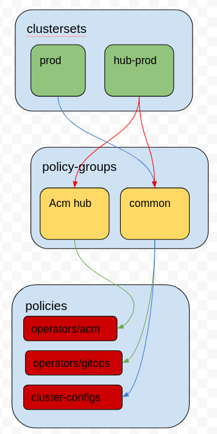

# Standard folder layout for Red Hat Advanced Cluster Management (ACM) Policies

As the title suggests this repository template is designed to act as a recommended directory structure and layout for managing ACM Policies using a GitOps based approach.  Focus is on addressing infrastructure configurations for multi-cluster deployments across multiple kubernetes distributions.

Designed loosely off the structure presented in [gitops-cop](https://github.com/redhat-cop/gitops-standards-repo-template)

## Repo Structure

The repository is structured with the following folders
  | Directory                                     | Description   |
  |--------                                       |-------------  |
  | [base](./base)                                | Contains kustomize configuration and transformers needed to allow overlays with ACM Policies. |
  | [build](./build)                              | CI scripts to perform code validation |
  | [clusterset](./clusterset)*                   | Directories aligning with `ManagedClusterSet` on the ACM Hub. |
  | [docs](./docs)                                | Documentation outlining the Policy prerequisites and suggested practices for Policy management |
  | [policies](./policies)*                       | Main directory containing ACM Policy definitions |
  | [policy-groups](./policy-groups)*             | Common Policy grouping to allow easier consumption by the ClusterSets |

  > `*` indicates primary folder for defining and managing policies.  Additional details below

## Basic Structure Flow

When implemented kustomize will be run against one of the clustersets.  It would be expected on a given ACM hub you are likely to have multiple ClusterSets.  This approach will allow managing changes through a GitOps practice ensuring a change is applied to specific ClusterSets in the order you define (Dev -> QA -> Prod).

A directory in the `clusterset` folder should represent a `ManagedClusterSet` in ACM.  ClusterSets are used to group clusters together based on common traits.  Generally this would be environment and is the structure that controls when and where infrastructure changes are made.  A change to a policy would impact all clusters within the ClusterSet.  If your release/change process separates environments between cloud you should configure the ClusterSets to represent that.  In this case you might have a qa-aws and a qa-vshere instead of a generic qa directory.

ClusterSets can include policy-groups or individual policies.

Policy-groups can include other policy-groups or one or more policies.  It is more common a group to include policies and not other groups.  But kustomize would allow such sub-grouping.

## Getting Started

To begin implementing this structure you should create a repository using this as a template.

#### Configure ClusterSets

Create a directory for each ClusterSet you need to define based on your environment.  Within the ClusterSet create the following using the example prod directory as a guide.
1. Update `policyset-suffixer.yml` with a suffix to be applied to any `PolicySet` created with the Policies.  This should match the name of the clusterset for easy identification. General preference is to only apply the suffix to the `PolicySet` and not all of the `Policies` as it is makes identification easier in the ACM UI.  There are kustomize configurations included that would allow adding a suffix to each policy.
2. Update `managedclusterset.yml` with the name of the ClusterSet.
3. Update the `kustomization.yaml` with the following details.
   1. Set the `namespace:` to a value for where you want the `Policy` and `Placements` created on the hub.  This needs to be unique, and should include the ClusterSet name to make identification easier.  Having a strong naming convention will help later.
      > Note even though the namespace transformer is configured in the kustomize file it is very important the default namespace configured in Policies and the PolicyGenerator is set to "policies".  Failure to do this results in kustomize not replacing the namespace name as expected.
